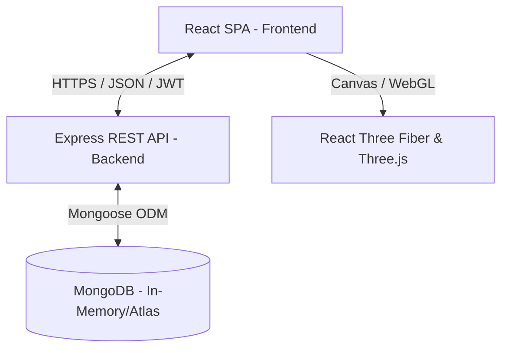

# Code Review & Architectural Analysis

A detailed evaluation of the **Rasin Arts** full-stack e-commerce codebase, examining architecture, implementation details, security, WebGL components, state management, and compliance with modern software engineering best practices.

---

## 1. Architectural Overview

The application follows a decoupled client-server architecture:
- **Backend**: Built with Node.js, Express, TypeScript, and MongoDB (via Mongoose).
- **Frontend**: A modern React Single Page Application (SPA) built with Vite, TypeScript, Tailwind CSS, Zustand, and React Three Fiber (R3F) for WebGL rendering.



---

## 2. Backend Analysis & Best Practices

### A. Folder Structure & Separation of Concerns
The backend codebase is organized logically, separating routing, business logic, data models, and helper utilities:
```
backend/src/
├── config/         # DB connection configs
├── controllers/    # Request handlers & business logic
├── middleware/     # Security guards, rate limiters, auth middleware
├── models/         # Mongoose schemas & schemas interfaces
├── routes/         # Express endpoint mappings
├── types/          # Shared TypeScript type definitions
└── utils/          # Seeder scripts and helpers
```
* **Review**: This separation follows the MVC (Model-View-Controller) pattern for REST APIs. Controllers do not directly bind to HTTP routing, making testing easier.

### B. Mongoose Schemas & Database Layer
- **User Schema**: Includes pre-save hooks to automatically hash passwords using `bcryptjs` and a validation helper (`matchPassword`). Emails are automatically lowercased and matched against a standard regex pattern.
- **Order Schema**: Seamlessly supports both authenticated users and guest checkouts by making `user` an optional reference while requiring `customerName`, `customerPhone`, and a full delivery address nested under the `ShippingAddressSchema`.
- **Product Schema**: Stores descriptive content alongside specifications, pricing (with optional discount prices), and 3D configuration data (`model3d`).
- **Best Practice Alert**:
  - We use standard Mongo schema indexes (like `unique: true` on user emails).
  - Pre-save hooks encapsulate schema-level side effects (like password hashing) instead of bleeding them into the controller layer.

### C. Security and Middleware Hardening
The backend contains a highly robust middleware chain:
- **Helmet**: Configured to inject 14 secure headers preventing clickjacking, MIME-type sniffing, and cross-site scripting (XSS).
- **Rate Limiters**: Prevents brute-forcing endpoints using distinct thresholds:
  - `loginRateLimiter`: Allows only 5 failed attempts per 15-minute window per IP. Successful requests are skipped (`skipSuccessfulRequests: true`).
  - `adminApiRateLimiter`: Limits admin operations to 300 requests per 15 minutes.
  - `publicApiRateLimiter`: Limits catalog browsing to 500 requests per 15 minutes.
- **JWT Protection & Role Validation**:
  - Validates tokens and parses an embedded `role` claim.
  - Verifies the `role` claim against the database user model to prevent privilege escalation via compromised/forged tokens.
  - Standardizes all verification failures to a generic `Unauthorized` response, eliminating username/user-state enumeration vectors.
- **Timing Attack Mitigation**:
  - During login, if a user is not found or input fails schema validation, the controller executes a dummy password check (`bcrypt.hash`) to equalize response latency. An attacker cannot discover valid user emails by timing server responses.

### D. Input Validation (Zod Schema Validation)
- Inputs for sensitive routes (e.g., Auth, Registration) are validated against rigid Zod schemas.
- Validates data types, email formats, and enforces a strict password policy:
  - Minimum 8 characters.
  - Minimum 1 uppercase letter.
  - Minimum 1 numerical digit.

---

## 3. Frontend Analysis & Best Practices

### A. Folder Structure
The React project uses a modern component-centric directory layout:
```
frontend/src/
├── components/      # UI components grouped by feature area
│   ├── 3d/          # WebGL models, canvases, and boundaries
│   ├── admin/       # Dashboard widgets, navigation sidebar, settings
│   ├── common/      # Navbar, footer, loaders, toast alerts
│   ├── product/     # Product cards, detail carousels, filter sidebars
│   └── review/      # Review lists, modal submission forms
├── hooks/           # Custom React hooks (e.g., useIdleTimer)
├── pages/           # Full-page route views
├── services/        # Axios API client wrapper
├── store/           # Zustand global state stores
└── types/           # Type definitions
```

### B. State Management (Zustand)
Global states are modularized using Zustand:
- **`useCartStore`**: Manages the shopping cart. Syncs with `localStorage` on any state update, allowing persistent guest sessions across page refreshes.
- **`useAuthStore`**: Stores active credentials in memory (safer from XSS than cookie/localStorage) and maintains the authenticated user object.
- **`useToastStore`**: Controls display of system notifications dynamically.

### C. 3D WebGL Engine & Error Resiliency
The application leverages Three.js, React Three Fiber (R3F), and `@react-three/drei` to render 3D GLB assets in real-time.
- **Model Load Resiliency**:
  - R3F's `useGLTF` hook normally crashes the React thread if a remote `.glb` asset returns a 404 or fails to load.
  - **The Fix**: The canvas components wrap the renderer inside a custom `ModelErrorBoundary` React class component.
  - If a model fails to load, the error is caught silently, and it displays a beautiful procedural fallback (an animated, warm resin orb with orbit rings) instead of crashing the client page.
- **Performance Optimizations**:
  - `ContactShadows` are positioned below the 3D model with customized opacity and blur factors to avoid high render overhead.
  - WebGL Context properties are configured for performance: `dpr={[1, 1.5]}` prevents rendering excessive pixels on high-density Retina screens.

---

## 4. Best Practices Compliance Audit

| Standard | Status | Details |
|---|---|---|
| **CORS Restriction** | ✅ Compliant | Replaced wildcard (`*`) with strict environment-defined allowed origins. |
| **Strict Type Safety** | ✅ Compliant | End-to-end TS on both backend and frontend. Interfaces map 1:1 between Mongoose and React. |
| **Password Policy** | ✅ Compliant | Enforced through backend Zod regex checks during registration. |
| **Session Control** | ✅ Compliant | Implemented automatic 2-hour idle timeout on admin dashboard with a warning countdown banner. |
| **Brute-Force Guard** | ✅ Compliant | Lockout UI locks admin login form for 60 seconds after 3 failed attempts, working alongside the backend rate limiter. |
| **GLB Fail Handling** | ✅ Compliant | Isolated R3F canvas nodes with standard React error boundaries and procedural fallback orbs. |

---

## 5. Areas for Improvement & Recommendations

1. **API Pagination**:
   - *Issue*: Product, order, and review lists currently fetch all records at once. As the database grows, this will slow down load times.
   - *Recommendation*: Implement cursor-based or limit/offset pagination on routes like `GET /api/products` and `GET /api/orders`.
2. **JWT Refresh Tokens**:
   - *Issue*: Admin tokens expire in 8 hours, and user tokens in 30 days. When they expire, users are forced to log back in abruptly.
   - *Recommendation*: Use short-lived access tokens (e.g., 15 minutes) paired with HTTP-only, secure, same-site refresh tokens stored in cookies.
3. **Optimized Assets (GLTF/GLB compression)**:
   - *Issue*: Loading raw 3D models can take several megabytes, degrading performance on mobile networks.
   - *Recommendation*: Run GLB files through compression utilities like `gltf-pipeline` (using Draco compression) to reduce file sizes by up to 80%.
